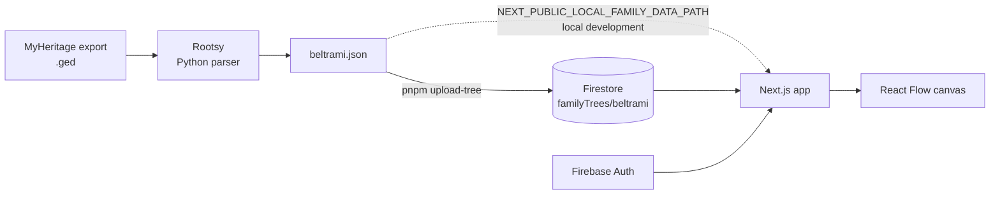

# beltrami.family

A private website that renders the Beltrami family tree, built with Next.js,
React Flow and Firebase.

The genealogical data comes from a GEDCOM export (MyHeritage), parsed into
JSON by [Rootsy](../rootsy), a typed Python GEDCOM parser written for this
project, and stored in Firestore behind Firebase Authentication.

## How it fits together



- **Public pages** (planned): an explanatory home with a demo tree and a short
  guide to GEDCOM. No family data.
- **Private pages**: the real tree, visible only to signed-in family members.

## Stack

| Concern | Choice |
| --- | --- |
| Framework | Next.js (App Router), React 19, TypeScript |
| Styling | Tailwind CSS |
| Tree canvas | `@xyflow/react` (React Flow 12) |
| Auth and data | Firebase Auth, Firestore |
| Tooling | pnpm, Biome, Jest + Testing Library, lefthook |
| Hosting | Vercel |

## Getting started

Requirements: Node 22.14+ and pnpm 12.4.2, both pinned in `.tool-versions`.
`package.json` carries a `packageManager` field, so Corepack picks up the
right pnpm on its own (`corepack enable`).

```sh
pnpm install
cp .env.example .env.local   # then fill in the values below
pnpm dev
```

Environment variables (`.env.local`):

| Variable | Purpose |
| --- | --- |
| `NEXT_PUBLIC_FIREBASE_PUBLIC_API_KEY` | Firebase web API key |
| `NEXT_PUBLIC_FIREBASE_AUTH_DOMAIN` | Firebase auth domain |
| `NEXT_PUBLIC_FIREBASE_PROJECT_ID` | Firebase project id |
| `NEXT_PUBLIC_LOCAL_FAMILY_DATA_PATH` | Optional. Path to a Rootsy JSON export to read instead of Firestore |

These are public by design (Firebase client config); access to data is
enforced by Firestore security rules and Authentication, not by hiding the key.

## Scripts

| Command | What it does |
| --- | --- |
| `pnpm dev` | Start the dev server |
| `pnpm build` / `pnpm start` | Production build and serve |
| `pnpm lint` / `pnpm format` | Biome check and format |
| `pnpm type-check` | TypeScript, no emit |
| `pnpm upload-tree <file.json>` | Upload a Rootsy export to Firestore |

## Loading family data

1. Export a GEDCOM file from MyHeritage (or any other tool).
2. Parse it with Rootsy:

   ```sh
   cd ../rootsy
   uv run python -c "
   import json, pathlib
   from rootsy.parser import parse_gedcom
   data = parse_gedcom('path/to/family.ged').to_dict()
   pathlib.Path('../beltrami.family/data/beltrami.json').write_text(json.dumps(data, indent=2))
   "
   ```

   (A `rootsy export` CLI is on the Rootsy roadmap and will replace this.)

3. Put a Firebase service account key at
   `config/firebase/service-account.json` (git-ignored).
4. Upload:

   ```sh
   pnpm upload-tree ./data/beltrami.json
   ```

The document id is derived from the file name, so `beltrami.json` becomes
`familyTrees/beltrami`, which is what the app reads.

### Reading a local export instead

To work against a fresh export without uploading it, point the app at the file:

```sh
# .env.local
NEXT_PUBLIC_LOCAL_FAMILY_DATA_PATH=./data/beltrami.json
```

The tree then comes from that file and Firestore is not touched. The file is
read on the server and served by `/api/family-tree`, so it is never bundled
into the pages; the route is disabled whenever the variable is unset, which is
how deployments run. Signing in is still required, as the tree page is behind
the protected layout either way.

Keep exports in `data/`, which is git-ignored: family data must not be
committed.

## Data shape

The types live in `src/lib/family/types.ts` and are shared by the app and the
upload script.

```ts
type FamilyData = {
  individuals: Record<string, FamilyMember>; // keyed by GEDCOM xref, e.g. "@I12@"
  families: Record<string, {
    id: string;
    husband?: string;
    wife?: string;
    children: string[];
  }>;
};

type FamilyMember = {
  id: string;
  name: string;            // raw "Given /Surname/"
  given_name?: string;
  surname?: string;
  sex?: string;
  birth?: { date?: { raw: string } };
  death?: { date?: { raw: string } };
  child_of_families: string[];  // FAMC
  spouse_in_families: string[]; // FAMS
};
```

Relationships follow GEDCOM: a `FAM` record links partners and children;
individuals reference families rather than each other.

## Project structure

```
src/app            routes and layouts (App Router)
src/components     UI components, one folder each
src/contexts       auth context
src/hooks          data-fetching hooks
src/lib            Firebase auth and Firestore access, local export reader,
                   family domain types and validation
src/helpers        config and pure helpers
scripts            Node tooling (Firestore upload, uses firebase-admin)
```

## Status and roadmap

The site works end to end (auth, data load, canvas) but the tree is drawn on a
naive grid and several fields are missing upstream. Planned work, in order:

1. Fix the parser output (events, family links, clean names) in Rootsy and
   re-import.
2. Proper generational layout for the tree.
3. Dependency upgrades (Tailwind 4, Biome 2, latest Next/React).
4. Public site: home, cats demo tree with flat illustrations and animation,
   GEDCOM explainer.
5. Person detail panel, search, pedigree and descendant views.

See `CLAUDE.md` for conventions and agent guidance.

## License

Private project. Family data is not included in this repository and must not
be added to it.
